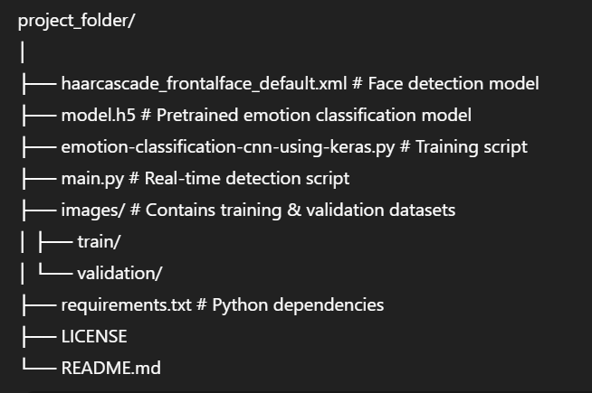

# Emotion Recognition System using CNN and Keras

This project implements a real-time facial emotion recognition system using a Convolutional Neural Network (CNN) trained with Keras and deployed using OpenCV. It detects human emotions from webcam video frames and classifies them into seven categories: Angry, Disgust, Fear, Happy, Neutral, Sad, and Surprise.

## 🧠 Features

- CNN model trained on grayscale 48x48 facial images
- Real-time face detection using OpenCV Haar Cascades
- Emotion classification using trained `.keras` or `.h5` model
- Visualization and evaluation (accuracy, precision, recall, F1-score, confusion matrix)

## 📁 Project Structure




## 🚀 How to Run

### 1. Clone the Repository
```bash
git clone https://github.com/Adityaverma18/Emotion-Recognition-System.git
cd emotion-recognition-system

2. Install Requirements

pip install -r requirements.txt

3. Train the Model (optional)
Make sure your dataset is organized under train/ and validation/.

python emotion-classification-cnn-using-keras.py

4. Run Real-Time Detection

python main.py


Press q to quit the webcam window.

📊 Model Performance
The training script will output model metrics such as:

Accuracy

Precision

Recall

F1 Score

Confusion Matrix

📄 License
This project is licensed under the MIT License — see the LICENSE file for details.

🤝 Contributing
Feel free to fork this repo and submit pull requests. Contributions are welcome!


---

## 🧾 `requirements.txt`

```txt
tensorflow>=2.12
keras>=3.0
opencv-python
numpy
matplotlib
pandas
seaborn
scikit-learn


